# GIT DAN GITHUB LANJUTAN
## Git *Introduction*
GIT adalah Tools untuk programmer yang berperan sebagai Version Control System.

**Apa itu *Version Control System***

Tugasnya adalah mencatat setiap perubahan pada File (termasuk code yang kita buat) pada suatu proyek baik dikerjakan secara individu maupun tim.

Git adalah aplikasi yang dapat melacak setiap perubahan yang terjadi pada suatu folder atau file. Git biasanya digunakan oleh para programmer sebagai tempat penyimpanan file pemrograman mereka, karena lebih efektif. File -file yg disimpan menggunakan git akan terlacak seluruh perubahannya, termasuk siapa yang mengubah.

**WHY should use GIT and Github?**

Dengan menggunakan GIT dan Github, kamu akan bisa bekerja dalam sebuat tim. Tujuan besarnya adalah kamu bisa berkolaborasi mengerjakan proyek yang sama tanpa harus repot copy paste folder aplikasi yang terupdate. Kamu juga tidak perlu menunggu rekan dalam satu tim kamu menyelesaikan suatu program dahulu untuk berkolaborasi. Kamu bisa membuat file didalam projek yang sama atau membuat code di file yang sama dan menyatukannya saat sudah selesai.

## Instalasi Git
Download dan jalankan hasil download GIT kamu seperti instal aplikasi pada umumnya.

**Cek apakah instalasi berhasil**

**Setup Awal**

Ada beberapa konfigurasi yang harus dupersiapakan sebelum mulai menggunakan Git, seperti name dan email.

Silahkan lakukan konfigurasi dengan perintah berikut ini.

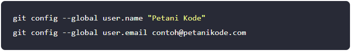

**Cek apakah setup berhasil**

Kemudian periksa konfigurasinya dengan perintah:

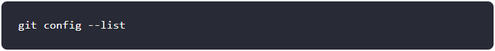

Apabila berhasil tampil seperti gambar berikut ini, berarti konfigurasi berhasil.

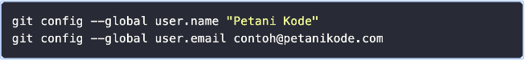

Perlu untuk diingat bahwa email yang disetup harus sama dengan yang digunakan pada GITHUB.

## *Repository* GIT
*Repository* dalam bahasa indonesia artinya gudang. *Repository* merupakan istilah yang digunakan untuk direktori proyek yang menggunakan Git. Jika kita memiliki sebuah direktori dengan nama proyek-01 dan di dalamnya sudah menggunakan git, maka kita sudah punya repositori bernama proyek-01.
Repository adalah direktori proyek yang kita buat.

        1 Repo =  1 Proyek = 1 Direktori

**Membuat *Repository***

Pembuatan *Repository* dapat dilakukan dengan perintah

Perintah **git init** akan membuat sebuah direktori bernama **.git** di dalam proyek kita. Direktori ini digunakan Git sebagai database untuk menyimpan perubahan yang kita lakukan.

Bagaimana jika folder sudah ada sebelumnya? kita bisa gunakan perintah berikut ini:

Tanda titik (**.**) artinya kita akan membuat *repository* pada direktori tempat kita berada saat ini.

## GIT STATUS, GIT ADD, GIT COMMIT
Buat 2-3 file code pada direktori yang telah dibuat.

### GIT Status
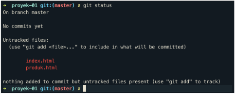

Terdapat 3 kondisi file pada GIT
1. *Modified*

    *Modified* adalah kondisi dimana revisi atau perubahan sudah dilakukan, tetapi belum ditandai dan belum disimpan di *version control*. Contohnya pada gambar di atas, ada tiga file HTML yang dalam kondisi *modified*.
2. *Staged*

    *Staged* adalah kondisi dimana revisi sudah ditandai, tetapi belum disimpan di *version control*. Untuk mengubah kondisi file dari *modified* ke *staged* gunakan perintah **git add nama_file**. Contoh:

    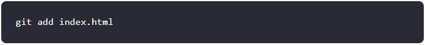

3. *Commited*

    *Commited* adalah kondisi dimana revisi sudah disimpan di *version control*. Perintah untuk mengubah kondisi file dari *staged* ke *commited* adalah **git commit**.

**Membuat Revisi Pertama pada GIT**

### GIT Add
Setelah cek status dengan **git status**, selanjutnya kita ubah status *untrackted file* dan *unmodified* menjadi *modified*. Gunakan **git add**

atau

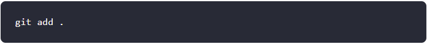

Setelah itu, cobalah ketik perintah **git status** lagi. Kondisi filenya sekarang akan menjadi *staged*.

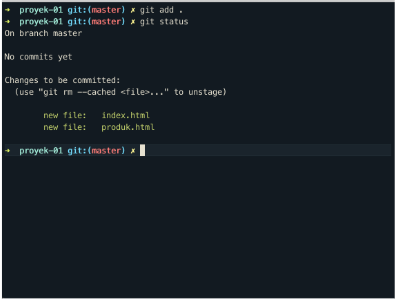

### GIT *Commit*
Setelah itu, ubah kondisi file tersebut ke commited agar semua perubahan disimpan oleh Git.

Setelah itu, coba cek dengan perintah **git status** lagi.

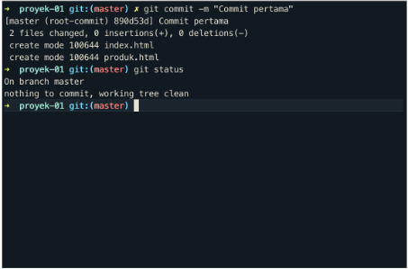

**Membuat Revisi Kedua pada GIT**

Ceritanya ada perubahan yang akan kita lakukan pada file index.html. Silahkan modifikasi isi file index.html.

Setelah itu ketik lagi perintah **git status**.

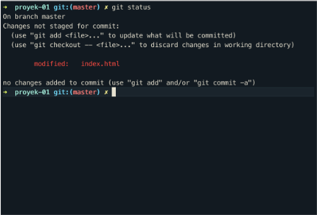

Terilhat bahwa file index.html sudah dimodifikasi. Kondisinya sekarang berada dalam *modified*. Lakukan *commit* lagi seperti revisi pertama.

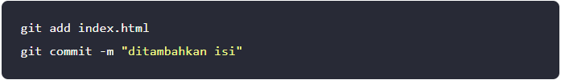

Dengan demikian, revisi kedua sudah disipan oleh Git. Argumen **-m** tersebut untuk menambahkan pesan setiap menyimpan revisi.

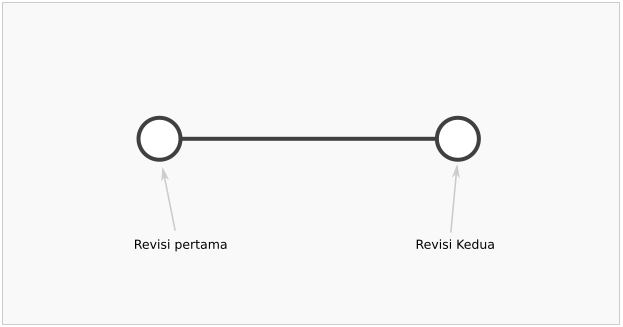

Sekarang Git sudah mencatat dua revisi yang sudah kita lakukan. Kita bisa ibaratkan revisi-revisi ini sebagai *checkpoint*. Apabila nanti ada kesalahan, kita bisa kembali ke *checkpoint* ini.

### GIT Log
Dari dua revisi yang sudah dilakukan kita dapat melihat catatan log dari revisi-revisi tersebut dengan menggunakan perintah berikut ini:

Akan tampil

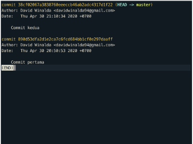

Untuk git log yang lebih pendek, bisa menggunakan perintah berikut ini:

Hasilnya:

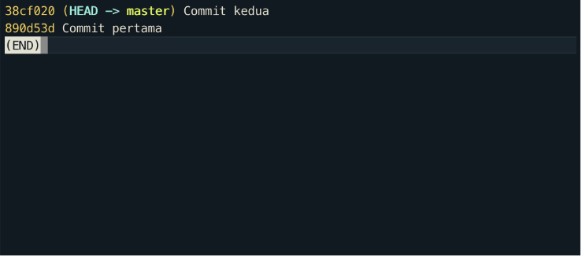

Melihat log dapat dilakukan dari berbagai sisi:
1. Melihat log dari nomor version/commit

    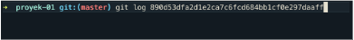

    Hasilnya

    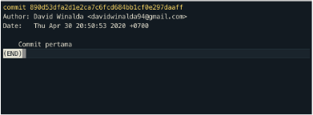

2. Melihat log dari file tertentu

    

    Hasilnya

    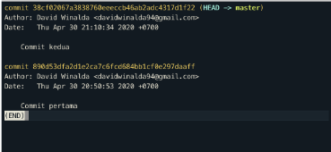

3. Melihat log dari berdasarkan author

    

    Hasilnya

    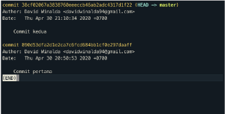

## GIT CHECKOUT, GIT RESET, GIT REVERT
Jika perubahan yang sedang dilakukan terjadi kesalahan dan kita ingin mengembalikan keadaan seperti sebelumnya maka itu bisa dilakukan.

### Membuat Revisi/Perubahan
Sebelum diubah:

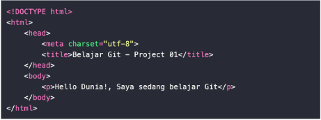

Setelah diubah:

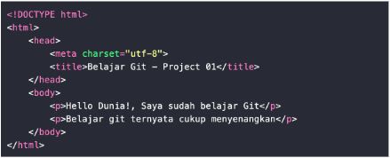

### Cek Perubahan
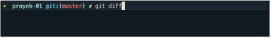

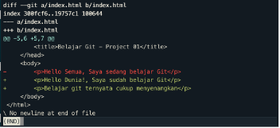

### Membatalkan Perubahan-Belum *Stagged* dan Belum *Commited*
Lakukan dengan perintah berikut ini:

Maka akan menjadi:

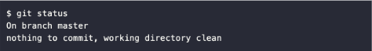

### Membatalkan Perubahan-Sudah *Stagged* namun Belum *Commited*
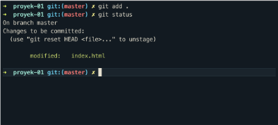

Jika case nya seperti diatas maka bisa dilakukan dengan perintah berikut ini: 

Maka akan menjadi:

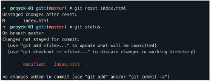

Kondisi file sudah pada kondisi *Modified*. Selanjutnya kita lakukan proses yg sama sebelumnya, menggunakan **git checkout**.

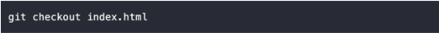

Maka akan menjadi:

### Membatalkan Perubahan-Sudah *Commited*
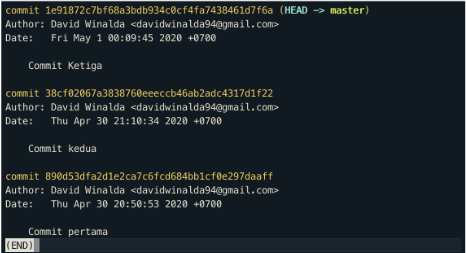

Kita bisa mengembalikan kondisi ke *commit* sebelumnya dari *commit* terakhir menggunakan nomor *commit*. Terdapat 2 jenis case antara lain:
1. Kita bisa mengembalikan *commit* hanya pada file tertentu.  
2. Kita bisa mengembalikan *commit* untuk semua file.

### Mengembalikan *Commit* pada File Tertentu
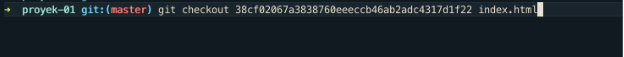

### Mengembalikan *Commit* untuk Semua File
Kita hanya perlu menggunakan nomor *commit* saja, tidak perlu menambahkan spesifik file. Berikut penggunaan perintahnya:

Jika ingin mengembalikan *commit* jauh ke bawah, misal kita ingin kembali pada 3 *commit* sebelumnya:

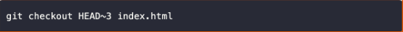

### GIT REVERT
GIT Revert akan membatalkan semua perubahan yang ada tanpa menghapus *commit* terakhir. Jika menggunakan GIT Reset, *commit* terakhir akan hilang.

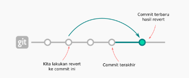

### GIT CHECKOUT
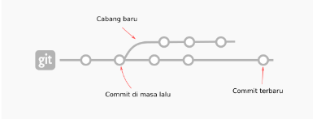

### GIT RESET
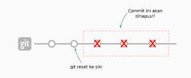

## GIT BRANCH
GIt *branch* merupakan fitur yang wajib digunakan jika berkolaborasi dengan developer atau dalam tim dan untuk menghindari conflict code yang dikembangkan. Kita tidak boleh berkolaborasi dalam *project* di satu *branch* yang sama!

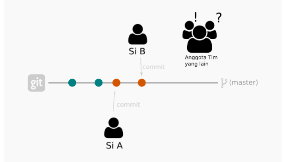

Misalnya Amira akan mengerjakan fitur A dan Widia mengerjakan fitur B. Masing-masing fitur harus dibuat *branch* masing-masing.
Tidak boleh mengganggu *branch* **master** yang sudah ter-*update*.

Untuk membuat *branch*, gunakan perintah berikut ini:

Misalkan kita ingin membuat fitur *register*, jadi kita akan membuat *branch* baru.

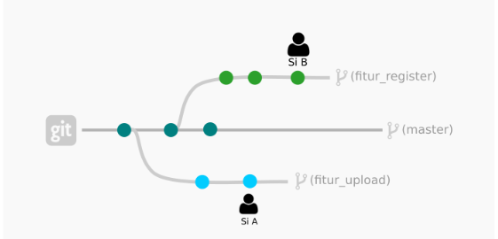

### Melihat *List Branch*

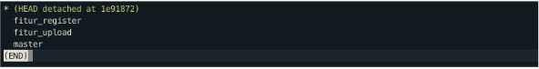

### Pindah ke *branch* tertentu
Untuk menuju ke dalam suatu *branch* tertentu, gunakan perintah seperti berikut ini:

### *Delete Branch*
Untuk menghapus sebuah *branch*, gunakan perintah seperti berikut ini:

## GIT MERGE
Setelah membuat *branch* baru, lalu lakukan *commit*. Kemudian kita menyatukan pekerjaan ke **master** *file*/*branch* utama yaitu *branch* **master**. Untuk menyatukan *branch* cabang fitur yang telah kita kembangkan, gunakan perintah seperti berikut ini:
1. Kita harus checkout dahulu ke branch master

    

2. Lalu lakukan merge

    

    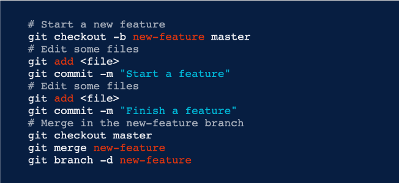