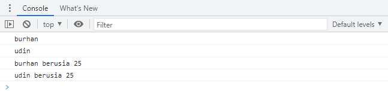
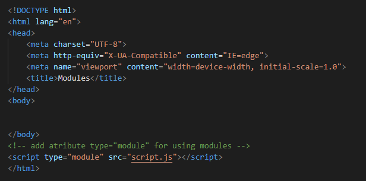

# GIT DAN GITHUB LANJUTAN
## Git *Introduction*
GIT adalah Tools untuk programmer yang berperan sebagai Version Control System.

**Apa itu *Version Control System***

Tugasnya adalah mencatat setiap perubahan pada File (termasuk code yang kita buat) pada suatu proyek baik dikerjakan secara individu maupun tim.

Git adalah aplikasi yang dapat melacak setiap perubahan yang terjadi pada suatu folder atau file. Git biasanya digunakan oleh para programmer sebagai tempat penyimpanan file pemrograman mereka, karena lebih efektif. File-file yg disimpan menggunakan git akan terlacak seluruh perubahannya, termasuk siapa yang mengubah.

***WHY should use* GIT *and* Github?**

Dengan menggunakan GIT dan Github, kamu akan bisa bekerja dalam sebuat tim. Tujuan besarnya adalah kamu bisa berkolaborasi mengerjakan proyek yang sama tanpa harus repot copy paste folder aplikasi yang terupdate. Kamu juga tidak perlu menunggu rekan dalam satu tim kamu menyelesaikan suatu program dahulu untuk berkolaborasi. Kamu bisa membuat file didalam projek yang sama atau membuat code di file yang sama dan menyatukannya saat sudah selesai.

## Instalasi Git
Download dan jalankan hasil download GIT kamu seperti instal aplikasi pada umumnya.

**Cek apakah instalasi berhasil**

***Setup* Awal**

Ada beberapa konfigurasi yang harus dipersiapakan sebelum mulai menggunakan Git, seperti name dan email.

Silahkan lakukan konfigurasi dengan perintah berikut ini.

    git config --global user.name "burhan-work"
    git config --global user.email burhan.bnw@gmail.com

**Cek apakah setup berhasil**

Silahkan gunakan perintah berikut:

    git config --list

Apabila konfigurasi berhasil, maka akan tampil seperti gambar berikut ini:

Perlu untuk diingat bahwa email yang di-*setup* harus sama dengan yang digunakan pada GITHUB.

## *Repository* GIT
*Repository* dalam bahasa indonesia artinya gudang. *Repository* merupakan istilah yang digunakan untuk direktori proyek yang menggunakan Git. Jika kita memiliki sebuah direktori dengan nama proyek-01 dan di dalamnya sudah menggunakan git, maka kita sudah punya repositori bernama proyek-01.
Repository adalah direktori proyek yang kita buat.

        1 Repo =  1 Proyek = 1 Direktori

**Membuat *Repository***

Pembuatan *Repository* dapat dilakukan dengan perintah

    git init proyek-01

Perintah **git init** akan membuat sebuah direktori bernama **.git** di dalam proyek kita. Direktori ini digunakan Git sebagai database untuk menyimpan perubahan yang kita lakukan.

Bagaimana jika folder sudah ada sebelumnya? kita bisa gunakan perintah berikut ini:

    git init .

Tanda titik (**.**) artinya kita akan membuat *repository* pada direktori tempat kita berada saat ini.

Kemudian buatlah 2 atau 3 file code pada direktori yang telah dibuat.

### GIT Status

Terdapat 3 kondisi file pada GIT
1. *Modified*

    *Modified* adalah kondisi dimana revisi atau perubahan sudah dilakukan, tetapi belum ditandai dan belum disimpan di *version control*. Contohnya pada gambar di atas, ada tiga file HTML yang dalam kondisi *modified*.
2. *Staged*

    *Staged* adalah kondisi dimana revisi sudah ditandai, tetapi belum disimpan di *version control*. Untuk mengubah kondisi file dari *modified* ke *staged* gunakan perintah **git add nama_file**. Contoh:

        git add index.html

3. *Commited*

    *Commited* adalah kondisi dimana revisi sudah disimpan di *version control*. Perintah untuk mengubah kondisi file dari *staged* ke *commited* adalah **git commit**.

**Membuat Revisi Pertama pada GIT**

### Git Add
Setelah cek status dengan **git status**, selanjutnya kita ubah status *untrackted file* dan *unmodified* menjadi *modified*. Gunakan **git add**

    git add index.html

atau

    git add .

Setelah itu, cobalah ketik perintah **git status** lagi. Kondisi filenya sekarang akan menjadi *staged*.

### Git *Commit*
Setelah itu, ubah kondisi file tersebut ke commited agar semua perubahan disimpan oleh Git.

    git commit -m "Commit pertama"

Setelah itu, coba cek dengan perintah **git status** lagi.

**Membuat Revisi Kedua pada GIT**

Ceritanya ada perubahan yang akan kita lakukan pada file index.html. Silahkan modifikasi isi file index.html.

Setelah itu ketik lagi perintah **git status**.

Terilhat bahwa file index.html sudah dimodifikasi. Kondisinya sekarang berada dalam *modified*. Lakukan *commit* lagi seperti revisi pertama.

    git add index.html
    git commit -m "ditambahkan isi"

Dengan demikian, revisi kedua sudah disimpan oleh Git. Argumen **-m** tersebut untuk menambahkan pesan setiap menyimpan revisi.

Sekarang Git sudah mencatat dua revisi yang sudah kita lakukan. Kita bisa ibaratkan revisi-revisi ini sebagai *checkpoint*. Apabila nanti ada kesalahan, kita bisa kembali ke *checkpoint* ini.

### Git Log
Dari dua revisi yang sudah dilakukan kita dapat melihat catatan log dari revisi-revisi tersebut dengan menggunakan perintah berikut ini:

    git log

Akan tampil

Untuk git log yang lebih pendek, bisa menggunakan perintah berikut ini:

    git log --oneline

Hasilnya:

Melihat log dapat dilakukan dari berbagai sisi:
1. Melihat log dari nomor version/commit

    

    Hasilnya

    

2. Melihat log dari file tertentu

        git log index.html

    Hasilnya

    

3. Melihat log dari berdasarkan author

        git log --author-'David Winalda'

    Hasilnya

    

Jika perubahan yang sedang dilakukan terjadi kesalahan dan kita ingin mengembalikan keadaan seperti sebelumnya maka itu bisa dilakukan.

### Membuat Revisi/Perubahan
Sebelum diubah:

Setelah diubah:

### Cek Perubahan
    git diff

### Membatalkan Perubahan-Belum *Stagged* dan Belum *Commited*
Lakukan dengan perintah berikut ini:

    git checkout index.html

Maka akan menjadi:

### Membatalkan Perubahan-Sudah *Stagged* namun Belum *Commited*

Jika case nya seperti diatas maka bisa dilakukan dengan perintah berikut ini: 

    git reset index.html

Maka akan menjadi:

Kondisi file sudah pada kondisi *Modified*. Selanjutnya kita lakukan proses yg sama sebelumnya, menggunakan

    git checkout index.html

Maka akan menjadi:

### Membatalkan Perubahan-Sudah *Commited*

Kita bisa mengembalikan kondisi ke *commit* sebelumnya dari *commit* terakhir menggunakan nomor *commit*. Terdapat 2 jenis case antara lain:
1. Kita bisa mengembalikan *commit* hanya pada file tertentu.  
2. Kita bisa mengembalikan *commit* untuk semua file.

### Mengembalikan *Commit* pada File Tertentu

    git reset index.html

### Mengembalikan *Commit* untuk Semua File
Kita hanya perlu menggunakan nomor *commit* saja, tidak perlu menambahkan spesifik file. Berikut penggunaan perintahnya:

Jika ingin mengembalikan *commit* jauh ke bawah, misal kita ingin kembali pada 3 *commit* sebelumnya:

    git checkout HEAD~3 index.html

### Git Revert
GIT Revert akan membatalkan semua perubahan yang ada tanpa menghapus *commit* terakhir. Jika menggunakan GIT Reset, *commit* terakhir akan hilang.

    git revert -n <nomor commit>

### Git Checkout

### Git Reset

## Git Branch
GIt *branch* merupakan fitur yang wajib digunakan jika berkolaborasi dengan developer atau dalam tim dan untuk menghindari conflict code yang dikembangkan. Kita tidak boleh berkolaborasi dalam *project* di satu *branch* yang sama!

Misalnya Amira akan mengerjakan fitur A dan Widia mengerjakan fitur B. Masing-masing fitur harus dibuat *branch* masing-masing.
Tidak boleh mengganggu *branch* **master** yang sudah ter-*update*.

Untuk membuat *branch*, gunakan perintah berikut ini:

    git branch <nama branch>

Misalkan kita ingin membuat fitur *register*, jadi kita akan membuat *branch* baru.

    git branch fitur_register

### Melihat *List Branch*
Gunakan perintah

    git branch

maka akan tampil:

### Pindah ke *branch* tertentu
Untuk menuju ke dalam suatu *branch* tertentu, gunakan perintah seperti berikut ini:

    git checkout <nama branch>

### *Delete Branch*
Untuk menghapus sebuah *branch*, gunakan perintah seperti berikut ini:

    git branch -d <nama branch>

## Git Merge
Setelah membuat *branch* baru, lalu lakukan *commit*. Kemudian kita menyatukan pekerjaan ke **master** *file*/*branch* utama yaitu *branch* **master**. Untuk menyatukan *branch* cabang fitur yang telah kita kembangkan, gunakan perintah seperti berikut ini:
1. Kita harus checkout dahulu ke branch master

        git checkout master

2. Lalu lakukan merge

        git merge halaman_login

    
Langkah-langkahnya:

    # start a new feature
    git checkout -b fitur-baru master

    # edit some files
    git add <file>
    git commit -m "start"

    # edit some files
    git add <file>
    git commit -m "finish"

    # merge di branch fitur-baru
    git checkout master
    git merge fitur-baru
    git branch -d fitur baru

# JAVASCRIPT INTERMEDIET
## Array dan Multidimensional Array
Mengorganisasi data dan menyimpan data adalah *core concept* dari programming. Array adalah tipe data *list order* yang dapat menyimpan tipe data apapun di dalamnya. Array dapat menyimpan tipe data String, Number, Boolean, dan lainnya.

### Membuat Array
Array didefinisikan menggunakan *square brackets*

    // square bracket
    []

### Mengakses/Memanggil Array
Array pada javascript dihitung dari *index* data ke-0. Data pertama adalah *index* ke-0.

    
    // menyimpan banyak type data (string, number, dan boolean)
    let data = ["burhan", 19, true];

    console.log(data);
    // output: ['burhan', 19, true]

Memanggil *index*:

    let list = [
        "belajar javascript",
        "belajar matematika",
        "membuat landing page"
    ];

    console.log(list[1]);
    // output: 'belajar matematika'

    console.log(list[0]);
    // output: 'belajar javascript'

### *Update* Array
Seperti tipe data dan variabel pada umumnya, kita dapat mengupdate data pada Array.

    let team = ["manager", "front end", "back end"];
    team[1] = "designer";

    console.log(team);
    //output: ['manager', 'designer', 'back end']

### *Const in* Array
1. Jika menggunakan let, kita dapat mengubah array  dengan array baru dan konten nilai yang ada di dalam array dengan nilai lain
2. Const tidak bisa melakukan *update* data. Namun pada array kita dapat melakukan *update* konten nilai di dalam array (*mutable*).
3. Yang tidak bisa adalah mengubah array dengan array yang baru jika menggunakan const

Contoh:

    const motor = ["suzuki", "yamaha", "honda"];
    motor = ["hurley"];

    console.log(motor);
    //output: error (tampilan console pada gambar di bawah)

    const motor = ["suzuki", "yamaha", "honda"];
    motor [1] = ["hurley"];

    console.log(motor);
    //output: ['suzuki', 'hurley', 'honda']

### Array *Properties*
Array memiliki 5 properti yang sering digunakan yaitu *constructor*, *length*, *index*, *input*, dan *prototype*. *Properties* adalah fitur yang sudah disediakan oleh Javascript untuk memudahkan developer.

**.length**

*Length* akan mengembalikan nilai dari jumlah panjang data suatu array.

    let team = ["manager", "front end", "back end"];

    console.log(team.length);
    //output: 3

**.prototype**

*Prototype* memungkinkan kita untuk menambahkan properti dan metode baru ke array. *Prototype* adalah properti yang tersedia dengan semua objek JavaScript.

**.constructor**

Properti konstruktor mengembalikan fungsi yang membuat prototipe Array.

### Array Method
Array memiliki method atau biasa disebut built-in methods. Artinya Javascript sudah memudahkan kita dengan menyediakan function/method umum yang bisa kita gunakan. Kita tidak perlu membuat function lagi jika method yang kita butuhkan sudah tersedia.

**Contoh Array Built-in Methods**

1. **.push()** adalah method untuk menambahkan item  array pada urutan yang paling akhir.

        let list = [
            "belajar javascript",
            "belajar matematika",
            "membuat landing page"
        ];

        list.push("kelas online programming");

        console.log(list);
        // output: ['belajar javascript', 'belajar matematika', 'membuat landing page', 'kelas online programming']

2. **.pop()** adalah method yang menghapus item array index terakhir.

        let list = [
            "belajar javascript",
            "belajar matematika",
            "membuat landing page"
        ];

        list.pop();

        console.log(list);
        // output: ['belajar javascript', 'belajar matematika']

3. **.shift()** adalah method untuk menghapus item Array pada index pertama.

        let list = [
            "belajar javascript",
            "belajar matematika",
            "membuat landing page"
        ];

        list.shift();

        console.log(list);
        // output: ['belajar matematika', 'membuat landing page']

4. **.unshift()** adalah method untuk menambahkan item Array pada index pertama.

        let list = [
            "belajar javascript",
            "belajar matematika",
            "membuat landing page"
        ];

        list.unshift("kelas online programming");

        console.log(list);
        // output: ['kelas online programming', 'belajar javascript', 'belajar matematika', 'membuat landing page']

5. **.sort()** adalah method untuk mengurutkan secara Ascending atau Descending Alphanumeric.

        const number = [2, 1, 8, 6, 7];
        number.sort();

        console.log(number);
        //output : [1, 2, 6, 7, 8]

### *Looping* pada Array
Array memiliki *built in methods* untuk melakukan *looping* yaitu **.map()** dan **.forEach()**. Kita harus tahu kapan menggunakan **.map()** dan juga **.forEach()**.
1. **.forEach()** adalah method untuk melakukan looping pada setiap elemen array.

        const motor = ["suzuki", "yamaha", "honda"];
        motor.forEach(elemen => {
            console.log(elemen);
        });
        // output:
        // suzuki
        // yamaha
        // honda

2. **.map()** melakukan perulangan/looping dengan membuat array baru.

        let array = [1, 2, 3, 4, 5];
        
        let newArray = array.map(num => {
            return num * 2;
        });

        console.log(newArray);
        // output : [2, 4, 6, 8, 10]

Kita bisa lihat bahwa **.map()** dan **.forEach()** sama-sama melakukan looping dan mengembalikan nilai baru dari operasi yang dilakukan. Perbedaannya adalah **.forEach** tidak dapat membuat Array baru dari hasil operasi yang ada dalam *looping*.

    let array = [1, 2, 3, 4, 5];
    newArray = array.forEach((num, index) => {
        return array[index] = num * 2;
    });

    console.log(newArray);
    // output : undefined

Jadi, gunakan **.forEach()** jika hanya memerlukan *looping* untuk menampilkan saja atau menyimpan ke database. Gunakan **.map()** jika akan melakukan operasi pada array seperti yang dapat mengubah nilai array sebelumnya.

### *Multidimensional* Array
*Multidimensional* Array bisa dianalogikan dengan array *of* array (ada array di dalam array).

Code script.js:

    let inventory = [
        ["Kaos", 5],
        ["Jaket", 3],
        ["Kemeja", 10],
        ["Jeans", 5],
        ["Sepatu", 3]
    ];

    console.log(inventory);

Tampilan pada console:

Bayangkan *multidimensional* ini seperti tabel. Baris pada tabel itu menunjukan jumlah array, kolom pada tabel itu menunjukan isi dari setiap array.

**Akses *index multidimensional* array**

    let inventory = [
        ["Kaos", 5],
        ["Jaket", 3],
        ["Kemeja", 10],
        ["Jeans", 5],
        ["Sepatu", 3]
    ];

    console.log(inventory[0][0]);
    // output: Kaos

    console.log(inventory[2][0]);
    // output: Kemeja

Sama seperti array satu dimensi, *multidimensional* array juga dapat menggunakan *property* dan *Method built-in* Array.

    let inventory = [
        ["Kaos", 5],
        ["Jaket", 3],
        ["Kemeja", 10],
        ["Jeans", 5],
        ["Sepatu", 3]
    ];

    inventory.push(["Sandal", 3]);

    console.log(inventory);

Tampilan pada console:

***Operation using map in multidimensional array***

Code script.js:

    let inventory = [
        ["Kaos", 5],
        ["Jaket", 3],
        ["Kemeja", 10],
        ["Jeans", 5],
        ["Sepatu", 3]
    ];

    // menghitung produk yang terjual (misal jumlah stok awal = 50 untuk semua produk)
    inventory.map(dataInventory => {
        let terjual = 50 - dataInventory[1];
        dataInventory[2] = terjual;
    });

    console.table(inventory);

Tampilan pada console:

***Looping For Multidimensional Array***

    let inventory = [
        ["Kaos", 5],
        ["Jaket", 3],
        ["Kemeja", 10],
        ["Jeans", 5],
        ["Sepatu", 3]
    ];

    inventory.forEach((baris) => {
        baris.forEach((column) => {
            console.log(column);
        });
    });

Tampilan di console:

Menggunakan *looping* **for**:

    let inventory = [
        ["Kaos", 5],
        ["Jaket", 3],
        ["Kemeja", 10],
        ["Jeans", 5],
        ["Sepatu", 3]
    ];

    // loop untuk array luar
    for (var i = 0, l1 = inventory.length; i < l1; i++) {
        // loop untuk array dalam
        for (var j = 0, l2 = inventory[i].length; j < l2; j++) {
            // akses each element dari array dalam
            document.write("
" + inventory[i][j] + "
");
        }
    }

Tampilan pada Web Page:

## *Object*
*Object* adalah sebuah tipe data pada variabel yang menyimpan nilai (properti) dan fungsi (*method*). Properti adalah data lengkap (ciri khas) dari sebuah *object* dan *method* adalah perilaku (*action*) dari sebuah *object*.

### Membuat Sebuah *Object*

Sama seperti tipe data sebelumnya, *object* dapat di-*assign* ke dalam sebuah variabel.

***Object person***

    let person = {};    //person is an empty object

***Object person* dengan properti**

    let person = {
        name : "Burhan",
        age : 25,
        major : "Mathematic",
        city : "Sumbawa"
    };

Sama seperti array, di dalam object kita dapat menyimpan properti dengan tipe data apapun.

### Mengakses *Object* dan *Property Object*
**Mengakses seluruh *object***

    let person = {
        name : "Burhan",
        age : 25,
        major : "Mathematic",
        'current address' : "Labuapi, Lombok"
    }

    console.log(person);

Tampilan di console:

Gunakan *single quote* (' ') pada *key* jika menggunakan spasi seperti ‘**current address**’.

**Mengakses properti *object***

    let person = {
        name : "Burhan",
        age : 25,
        major : "Mathematic",
        'current address' : "Labuapi, Lombok"
    }

    console.log(person.major);
    // output: Mathematic

Kita juga bisa menggunakan ***bracket notation*** saat memanggil properti dari sebuah *object*.

    let person = {
        name : "Burhan",
        age : 25,
        major : "Mathematic",
        'current address' : "Labuapi, Lombok"
    }

    console.log(person["major"]);
    // output: Mathematic

    console.log(person["name"]);
    // output: Burhan

### *Update Object*

Kita dapat melakukan *update* pada variabel dengan tipe data *object*.

- *Do's*

    *Object* dapat meng-*update value* dari *key* yang sudah tersedia dan dapat menambahkan *key* dan *value* baru.

      let person = {
        name : "Burhan",
        age : 25,
        major : "Mathematic",
        'current address' : "Labuapi, Lombok"
      }

      // update current key with the new value
      person.age = 27;

      // add new key and value
      person.address = "Alas Barat, Sumbawa"

      console.log(person);

    Tampilan di console:

    

- *Dont's*

    Jika menggunakan **const** pada variabel *object*, kita tidak bisa mengganti seluruh data *object* dengan *object* yang baru.

        const person = {
        name : "Burhanuddin",
        age : 25,
        major : "Mathematic",
        'current address' : "Labuapi, Lombok"
        }

        person = {
            fullname : "Burhanuddin"
        }

        console.log(person);

    Tampilan di console:

    

    Jadi, jika ingin melakukan *update* unuk seluruh data *object* gunakan **let** pada saat deklarasi variabel.

### *Delete Object Property*
    let person = {
        name : "Burhan",
        age : 25,
        major : "Mathematic",
        'current address' : "Labuapi, Lombok"
    }

    // Delete property object age dari data people
    delete person.age;

    console.log(person);

Tampilan di console:

### *Method*
*Method* adalah *value* yang kita masukkan pada properti berupa *function*.

Membuat *method* untuk *greeting* pada aplikasi *e*-*commerce* misalnya:

    const greeting = {
        welcome : function () {
            return "Halo, selamat datang";
        },
        afterTransaction : function () {
            return "Terima kasih sudah membeli";
        }
    };  // ada 2 method pada object greeting

    console.log(greeting.welcome());
    // output: Halo, selamat datang

    console.log(greeting.afterTransaction());
    // output: Terima kasih sudah membeli

### *Nested Object*
*Object* yang berasal dari turunan *object* lainnya (data *object* yang kompleks). Contohnya data article pada sebuah aplikasi berita:

    const news = {
        title : "AMMAN Coding Bootcamp",
        description : "Beasiswa pelatihan coding untuk pemuda Sumbawa",
        author : {
            person: {
                name : "Burhanuddin",
                age : 25,
                city : "Sumbawa"
            }
        }
    };

    console.log("News:", news.title);
    console.log("Article publish by", news.author.person.name);

Tampilan di console:

### *Pass by reference*
*Pass by reference* artinya kita bisa mengubah data yang ada pada *object* melalui sebuah *function* dan memasukkan *object* sebagai parameter *function*.

Kita mengubah data object number dengan sebuah **function changeData**:

    let number = {
        oriA : 3,
        oriB : 4
    };

    function changeData (obj) {
        obj.oriA = 6;
        obj.oriB = 8;
    };

    changeData(number)

    console.log(number.oriA);
    // output: 6

    console.log(number.oriB);
    // output: 8

### *Looping Object*
Jika kita ingin menampilkan seluruh *object* properti. Kita bisa menggunakan *looping*. Jadi tidak perlu mengakses secara manual memanggil setiap propertinya.

    for(let key in object) {
        // ...
    };

Contohnya:

    const news = {
        title : "AMMAN Coding Bootcamp",
        description : "Beasiswa pelatihan coding untuk pemuda Sumbawa",
        author : {
            person: {
                name : "Burhanuddin",
                age : 25,
                city : "Sumbawa"
            }
        }
    };

    for(let data in news) {
        console.log(news[data]);
    };

Tampilan di console:

    const news = {
        title : "AMMAN Coding Bootcamp",
        description : "Beasiswa pelatihan coding untuk pemuda Sumbawa",
        author : {
            person: {
                name : "Burhanuddin",
                age : 25,
                city : "Sumbawa"
            }
        }
    };

    for(let author in news.author.person) {
        console.log(news.author.person[author]);
    }

Tampilan di console:

### Array *of Object*
    let student = [
        {
            name : "burhan",
            age : 25,
            city : "Sumbawa"
        },

        {
            name : "abiem",
            age : 24,
            city : "Sumbawa"
        },

        {
            name : "anto",
            age : 25,
            city : "Sumbawa"
        }
    ];

    // gunakan forEach jika object berada di dalam array
    student.forEach((listStudent) => {
        console.log(listStudent);
    });

Tampilan di console:

## *Recursive*
*Recursive* adalah fungsi yang memanggil dirinya sendiri sampai kondisi tertentu. *Recursive* biasanya digunakan untuk *case* matematika, fisika, kimia, dan yang berhubungan dengan kalkulasi.

**Struktur *recursive***

    function recursive() {
        // ...
        recursive();
        // ...
    }

***Recursive* akan berhenti memanggil dirinya sendiri jika kondisi terpenuhi**

    function recursive() {
        if(condition) {
            // stop calling itself
            // ...
        } else {
            recursive();
        }
    }

**Ciri-ciri *recursive***

1. Fungsi *recursive* selalu memiliki kondisi yang menyatakan kapan fungsi tersebut berhenti. Kondisi ini harus dapat dibuktikan akan tercapai, karena jika tidak tercapai maka kita tidak dapat membuktikan bahwa fungsi akan berhenti, yang berarti algoritma kita tidak benar.
2. Fungsi *recursive* selalu memanggil dirinya sendiri sambil mengurangi atau memecahkan data masukan setiap panggilannya. Hal ini penting diingat, karena tujuan utama dari *recursive* ialah memecahkan masalah dengan mengurangi masalah tersebut menjadi masalah-masalah kecil.

**Contoh kasus rekursif**

1. Fungsi *recursive* menghitung mundur *number*

        function countDown(number) {
            console.log(number);

            let nextNumber = number - 1;

            // jika kondisi ini bernilai false maka recursive berhenti
            if (nextNumber > 0) {
                countDown(nextNumber);
            }
        }
        countDown(5);

    Tampilan di console:

    

2. Mencari hasil dari nilai pangkat dengan *recursive*

        function pow(x, n) {
            if (n==1) {
                return x;
            } else {
                return x * pow(x, n - 1);
            }
        }

        console.log(pow(3, 4));
        // output: 81

## Regex
Regex adalah susunan/deretan karakter spesial yang menggambarkan pola untuk pencarian text pada sebuah string atau dokumen. Contoh kasus Regex:
- Validasi input dari sebuah FORM,
- Mencari keyword tertentu pada email atau halaman web,
- Mencari IP address dalam kisaran tertentu, dll.

### *Literals*
*Literals* adalah konsep regex yang paling sederhana dimana kita membuat regex sesuai dengan *text* yang ingin kita cari/match atau mengandung text yang kita cari.

### test()
Javascript regex punya beberapa *built-in methods* untuk Regex. Sala satunya adalah **test()**. **test()** mengembalikan nilai BOOLEAN (TRUE/FALSE) untuk kecocokan sebuat text yang dicari.

    let regex = new RegExp("monkey");
    console.log(regex.test("monkey"));
    // output: true

    let regex1 = /monkey/;
    console.log(regex1.test("monkey"));
    // output: true

    let regex = new RegExp("monkeys");
    console.log(regex.test("monkey"));
    // output: false

    let regex1 = /monkeys/;
    console.log(regex1.test("monkey"));
    // output: false

### Karakter Set
Jika ingin mendapatkan hasil *searching* setidaknya mengandung 1 karakter yang dicari, kita bisa menggunakan karakter set untuk mencari minimal 1 karakter yang sesuai. Karakter set menggunakan *bracket square* []

    let regex = new RegEExp("[a-z]");
    console.log(regex.test("abc"));
    // output: true

    let regex1 = /[a-z]/;
    console.log(regex.test("monkey"));
    // output: true

    let regex2 = /[1-5]/;
    console.log(regex.test(7));
    / output: false

### match()
**match()** sama seperti **test()** yaitu sebuah *method* bawaan dari javascript. Namun **match()** mengembalikan nilai array dari karakter yang *match*.

    let regex = /a/;
    let name = "Ahmad Fauzul Kabir";

    console.log(name.match(regex));

Tampilan di console:

Ada 2 *problem* yang harus di-*solve*:
- regex hanya ada di index ke-3 untuk pencarian text ‘a’, padahal di awal ada ‘a’ juga.
- hanya ada 1 karakter yang terbaca, padahal ada 4 karakter ‘a’ pada nama ‘Ahmad Fauzul Kabir’.

***Problem* di atas dapat kita *solve* menggunakan Flags**

### Flags
Ada 2 **flags** yang sering digunakan:
- i = Untuk menghandle case-sensitive. Tidak mempermasalahkan besar kecilnya sebuah karakter. Tidak membedakan antara A dan a.

        let regex = /a/i;
        let name = "Ahmad Fauzul Kabir";

        console.log(name.match(regex));

    Tampilan di console:

    

- g = Untuk mencari ke dalam seluruh string yang ingin dicari. Jika tidak menggunakan flags g, maka sistem akan mengembalikan nilai array pertama yang ditemukan saja atau tidak melanjutkan pencarian.

        let regex = /a/ig;
        let name = "Ahmad Fauzul Kabir";

        console.log(name.match(regex));

    Tampilan di console:

    

### Karakter *Set Short Syntax*
Ada beberapa *short syntax* untuk kumpulan grup karakter:
- \d : Seluruh number/digit character. Contohnya [0-9]
- \w : Alphanumeric character (26 huruf abjad dan angka). Contohnya [A-Za-z0-9_]
- \s : Whitespace character (space, tab, newline, and similar). Contohnya [\t\r\n\f\v]

Misalnya kita membuat format regex: /d/s/w/w/w/w/w/w/w

Ini berarti digit diikuti spasi lalu diikuti dengan 7 *word character*. Regex di atas akan *match* dengan string berikut **3 monkeys**.

    let regex = /\d\s\w\w\w\w\w\w\w/;
    let name = "3 monkeys";

    console.log(regex.test(name));
    // output: true

### Negasi dari Karakter *set short syntax*
Kita juga bisa menggunakan negasi dari ketiga karakter *set short syntax* sebelumnya:
- \D : TIDAK mengandung seluruh number/digit character. Contohnya [^0-9]
- \W : TIDAK mengandung Alphanumeric character (26 huruf abjad dan angka). Contohnya [^A-Za-z0-9_]
- \S : TIDAK mengandung Whitespace character (space, tab, newline, and similar). Contohnya [^\t\r\n\f\v]

*Icon set caret* (^) merupakan negasi dari *pattern* regex yang dibuat.

    let negasi = /[01]/;

    console.log(negasi.test("010101010110"));
    // output: false

    console.log(negasi.test("010101023"));
    // output: true

### *Quantifiers*
- Sebelumnya kita membuat contoh regex seperti ini: \d\s\w\w\w\w\w\w\w
- *Quantifiers* adalah membuat format diatas menjadi lebih baik dan rapih. *Quantifiers* ditandai dengan format *curly braces* {}.
- \w{3} : akan match dengan 3 kata/word karakter
- \w{4,7}: akan match minimum 4 kata/word character dan maksimal 7 kata/word character

roa{3}r akan match jika kita melakukan pencarian string ‘roaaar’.

Quantifiers bersifat greedy. Jika ada regex roa{3,7}r lalu ada pola yang mendekati seperti ‘roaaar’, ‘roaaaar’, dan ‘roaaaaaaa’. Maka yang didapatkan adalah a yang paling besar atau maksimal.

### *Quantifiers* - 0 *or more*, 1 *or more*
*Quantifiers* sebelumnya tidak bisa *handle* untuk kemiripan *text* yang dicari dengan regex yang dibuat. Untuk mengatasi ini kita bisa menggunakan asterik (*) atau plus (+).

- (*) : Karakter yang diikuti dengan * dibolehkan tidak tampil sama sekali atau boleh tampil satu kali, dan seterusnya

        let regex = /dav*id/;

        console.log(regex.test("daid"));
        // output: true

- (+) : Karakter yang diikuti dengan + dibolehkan minimal tampil 1 kali dan seterusnya

        let regex = /dav+id/;

        console.log(regex.test("daid"));
        // output: false

        let regex = /wi+nalda/;

        console.log(regex.test("wiiinalda"));
        // output: true

### *Anchor*
Jika kita ingin mencari karakter yang persis detail sama, kita bisa menggunakan *Anchor*. Diawali dengan (^) dan diakhiri dengan ($).

    let search = /^Belajar react js$/;

    console.log(search.test("Belajar react js"));
    // output: true

    let search1 = /^Belajar react js$/;

    console.log(search11.test("Belajar react"));
    // output: false

### *Alternation* (|)
    let search = /^Belajar react js$|^React JS$/;

    console.log(search.test("React JS"));
    // output: true

## OOP and Modules
### *Object Oriented Programming* (OOP)
*Object Oriented Programming* (OOP) adalah suatu paradigma dalam pemrograman. OOP adalah *principle*, jadi dapat diterapkan pada bahasa pemrograman selain Javascript seperti Ruby, Python, dan Java. Pada pembahasan sebelumnya, kita tahu bahwa tipe data dalam javascript terdiri dari 6 tipe data *primitive* (*value type*), di antaranya:

- string
- number
- boolean
- null
- undefined
- Symbol (ES6)

Ada juga yang disbut *reference type*, yaitu:

- Object
- Function
- Array

Sebagai contoh, kita akan membuat sebuah *object person* yang terdiri dari *property* dan *method*.

   let person = {
        name : "burhan",
        age : 25,
        detail : function() {
            return (this.name) + " berusia " + (this.age)
        },
    };

    let person1 = {
        name : "udin",
        age : 25,
        detail : function() {
            return (this.name) + " berusia " + (this.age)
        },
    };

    console.log(person.detail());
    console.log(person1.detail());

Tampilan di console:

Saat ini OOP dapat dibuat menggunakan:

- function

        function person(name, age) {
            this.name = name;
            this.age = age;
            this.detail = function() {
                return (this.name) + " berusia " + (this.age)
            };
        }

        let person1 = new person("burhan", 25);
        let person2 = new person("udin", 25);

        console.log(person1.name);
        console.log(person2.name);
        console.log(person1.detail());
        console.log(person2.detail());

    Tampilan di console:

    

- class (ES6)

        class person {
            constructor(name, age) {
                this.name = name;
                this.age = age;
            }
            detail() {
                return (this.name) + " berusia " + (this.age)
            };
        };

        let person1 = new person("burhan", 25);
        let person2 = new person("udin", 25);

        console.log(person1.name);
        console.log(person2.name);
        console.log(person1.detail());
        console.log(person2.detail());

    Tampilan di console:

    

**This** adalah sebuah keyword khusus yang merujuk pada objek pemiliknya. Maksudnya adalah nilai dari **this** sangat bergantung pada dimana keyword **this** ini diletakkan atau dipanggil. Jika **this** digunakan dalam sebuah method maka ia merujuk pada objek pemiliknya. Jika **this** di dalam sebuah function maka ia merujuk pada global objek atau window. Dalam kasus function constructor dan class maka keyword this ini mengacu pada objek instannya.

Ada 4 pilar dalam OOP, yaitu:

1. Encapsulation

    Encapsulation adalah cara untuk membatasi akses langsung ke properti atau method dari sebuah objek.

        function grab (jarak) {
            const pricePerKm = 5000;
            this.jarak = jarak;
            this.price = function () {
                return this.pricePerKm * this.jarak;
            }
        }

        let client = new grab(3);
        client.pricePerKm = 10000;

        console.log(client.price());
        // output: 15000

2. Abstraction

    Abstraction adalah sebuah teknik untuk menyembunyikan detail tertentu dari sebuah objek/method dan hanya menampilkan fungsionalitas atau fitur penting dari objek tersebut. Terkadang method yang tidak memiliki body pada parent class. 
    
    Kita analogikan seperti ini. Setiap hari kamu berangkat ke kantor dengan mengendarai mobil pribadimu. Kamu sebenarnya tidak perlu tahu bagaimana mesin mobil itu bekerja sampai membuat mobilnya bisa bergerak atau bagaimana sistem pembakaran dalam mesinnya dan apa yang terjadi di dalam mesin ketika kamu menginjak pedal gas. Yang perlu kamu tahu adalah cara menyalakan mobil dan tau cara menyetir.

        class hero {
            constructor(hp) {
                this.health = hp;
            }

            fight() {
            this.health += 50;
            return this.helath;
            }

            eat() {
                this.health += 100;
                return this.health;
            }
        }

        let alpha = new hero(500);

        console.log(alpha.fight());
        console.log(alpha.eat());

    Tampilan di console:

    

3. Inheritance

    Inheritance dalam OOP adalah sebuah proses dimana sebuah class mewariskan property dan methodnya ke class lain atau childnya.

        class people {
            constructor(name, age) {
                this.name = name;
                this.age = age;
            };

            detail() {
                return (this.name) + " berusia " + (this.age);
            };
        };

        class person extends people {
            constructor(name, age, job) {
                super(name, age);
                this.job = job;
            };
        };

        let client = new person("burhan", 25, "front end developer");

        console.log(client.name);
        console.log(client.job);
        console.log(client.detail());

    Dari kode di atas, berarti class people mewariskan property name dan age ke class person.

    Tampilan di console:

    

4. Polymorpishm

    Secara bahasa, polymorphism berasal dari dua kata, yaitu poly yang berarti banyak dan morphism yang berarti bentuk. Polymorpish ini juga dikenal pada konsep OOP yang berarti kemampuan dari suatu objek untuk memiliki banyak bentuk. Pada pilar sebelumnya yaitu inheritance, child class dapat mewarisi properti dan method dari parent class. Nah pada Polymorpishm, method yang diwariskan bisa kita ubah dengan behaviour yang berbeda menyesuaikan child class yang kita buat.

        class animal {
            animalSound() {
                console.log("the animal makes a sound");
            }
        }

        class cat extends animal {
            animalSound() {
                console.log("miaaww");
            }
        }

        let persiaCat = new cat();
        persiaCat.animalSound();

    Tampilan di console:

    

### Modules
Modules adalah reusable code yang dapat di-export dari suatu file jaavascript dan di-import ke file javasript yang lain. Reusable code di sini adalah data yang dapaat digunakan berulang kali. Kita dapat melakukan export pada data apapun seperti string, object, array, number, class, hingga function/method.

Berikut alasan kenapa harus membuat program mejadi modules:

- Mudah menemukan dan mengatasi debug pada program
- Membuat program menjadi komponen-komponen kecil sehingga code lebih mudah dibaca, dimengerti, dan mudah dimaintain
- Reusable code, kita cukup membuat logic method pada suatu file lalu gunakan method tersebut pada file lainnya

**Membuat Modules**

Terdapat beberapa cara untuk membuat modules javascript, di antaranya:

- Menggunakan Node JS
- Menggunakan Common JS
- Menggunakan ES6 Features

**Preparation**

Sebelum menggunakan export import untuk membuat modules, terdapat beberapa syarat yang harus disiapkan di antaranya:

- Pada saat menjalankan modules, kita tidak bisa menggunakan url local komputer kita di browser
- Harus menggunakan static-server
- Gunakan wxtension Live Server pada Visual Studio Code
- Kemudian pada file index.html, kita harus menambahkan script atribute type untuk modules

    

**Export dan Import**

Kita akan membuat modules untuk greeting pada toko online.

- Siapkan file index.html

    

- File script.js sebagai file javascript utama/main yang dipanggil pada file index.html

    

- Pada file greeting.js kita membuat 2 method/function yang reusable. Kita bisa gunakan method tersebut di setiap program aplikasi kita jika dibutuhkan. Agar function/method pada file greeting.js dapat digunakan, kita harus menambahkan keyword export pada setiap function.

       

    Memanggil method sayHi:

    

    Memanggil method sayThanks:

    

    Cara lain melakukan export:

    

**Export as**

Pada saat melakukan export, kita bisa mengganti nama function, variabel, dan data lainnya menggunakan keyword "as".

File greeting.js

File script.js

**Import as**

Kita juga bisa mengubah langsung nama data yang kita import menggunakan keyword "as".

File script.js

**Export default**

Export default dapat digunakan jika hanya ada 1 data atau export single class component.

Pada file greeting.js

    // export default
    export default function sayHi(user) {
        alert("Hallo " + (user));
    }

Pada file script.js

    // import dari export default tidak menggunakan curly braces
    import sayHi from './greeting.js';

    sayHi("burhan");

## Web Storage
### Introduction
Ada beberapa cara untuk menyimpan data pengguna seperti pencarian, artikel berita, dan lain-lain ke lokal (browser) menggunakan web storage seperti *cookies*, *local storage*, dan *session storage*. Data ini dimanfaatkan oleh situs web tersebut untuk merekam kebiasaan pengguna agar dapat memberikan rekomendasi sesuai preferensi si pengguna tersebut.

**Apa itu *Cookies*?**

*Cookies* adalah data kecil yang dikirim dari situs web dan disimpan di komputer kita oleh web browser saat kita menjelajah. Disebut data kecil karena maksimum data yang dapat disimpan dalam cookies adalah 4096 bytes (4 KB).

Biasanya data yang disimpan di cookies adalah access token pengguna saat login atau data pencarian saat melakukan pencarian pada situs web tertentu. Hal ini yang biasanya dilakukan oleh situs pencarian untuk melacak pencarian kita dan menampilkan iklan yang berhubungan dengan pencarian kita sebelumnnya.

Namun ada beberapa kekurangan yang perlu kita perhatikan mengenai cookies di antaranya:

1. Setiap kita mengakses situs web, cookies juga kembali dikirim sehingga memperlambat aplikasi web kamu dengan mengirimkan data yang sama.
2. Cookies disertakan pada setiap HTTP request, sehingga mengirimkan data yang tidak dienkripsi melalui internet, maka saat kita ingin menyimpan data dalam cookies kita harus mengenkripsinya terlebih dahulu.
3. Cookies hanya dapat menyimpan data sebanyak 4KB.
4. Lalu cookies juga memiliki tanggal kadaluarsa. Tanggal ini telah ditentukan sehingga web browser bisa menghapus cookies jika tanggal sudah kadaluarsa atau tidak dibutuhkan.

***Local Storage* dan *Session Storage***

Dengan memanfaatkan *local storage* dan *session storage*, kita dapat menyimpan data lebih besar yaitu 5MB per *page* tanpa mempengaruhi kinerja situs web. Namun, penting untuk diketahui agar kita tidak menyimpan data sensitif seperti *password* ke dalam *local storage* ataupun *session storage* untuk menghindari serangan pencurian data.

### *Local Storage* - Menyimpan Data
Pernahkah kita saat melakukan pencarian pada sebuah situs lalu situs tersebut menampilkan riwayat pencarian kita? Iya, data pencarian tersebut disimpan ke dalam local storage untuk diolah menjadi riwayat pencarian. Itulah salah satu contoh penerapan dari *local storage* pada aplikasi web.

*Local storage* memiliki karakteristik sebagai berikut:

1. Menyimpan data tanpa tanggal kadaluarsa.
2. Data tidak akan dihapus ketika web browser ditutup dan akan tersedia seterusnya selama kita tidak menghapus data local storage pada web browser.
3. Dapat menyimpan data hingga 5MB.
4. Hanya dapat menyimpan data string.

Untuk menyimpan data pada *local storage*, kita menggunakan *method* **setItem()** yang membutuhkan 2 parameter. Parameter pertama adalah *key* yang ingin kita simpan dan parameter kedua adalah data (*value*) dari *key* yang akan disimpan.

    localStorage.setItem('key', value);

### *Local Storage* - Mengambil Data
Untuk mengambil data yang telah tersimpan pada *local storage*, kita dapat menggunakan *method* **getItem()** yang membutuhkan 1 parameter. Parameter tersebut adalah *key* dari data yang kita inginkan.

    localStorage.getItem('key');

### *Local Storage* - Menghapus Data
Untuk menghapus data yang telah tersimpan pada *local storage*, kita dapat menggunakan *method* **removeItem()** yang membutuhkan 1 parameter. Parameter tersebut adalah *key* dari data yang ingin kita hapus.

    // menghapus key tertentu
    localStorage.removeItem("key");

    // menghapus semua key
    localStorage.clear();

### *Session Storage* - Menyimpan Data
Berbeda dengan *local storage*, walaupun masuk ke dalam web *storage*, data yang tersimpan pada *session storage* akan hilang ketika *session* dari sebuah laman berakhir.

*Session storage* mempunyai beberapa karakteristik, yaitu:

1. Data yang disimpan pada *session storage* akan terus tersimpan selama *browser* terbuka dan tidak hilang jika laman di-*reload*.
2. Membuka banyak tab/window dengan URL yang sama, akan menciptakan *session storage* yang berbeda di masing-masing tab/window.
3. Menutup tab/window akan mengakhiri *session* dan menghapus data yang tersimpan di *session storage* pada tab/window tersebut.
4. Data yang tersimpan dalam *session storage* harus berbentuk string.
5. Hanya dapat menyimpan data sebanyak 5MB.

Pada umumnya kita memanfaatkan *session storage* untuk menyimpan data keranjang belanja pada sebuah situs *e*-*commerce*. Kita tentu pernah memasukkan beberapa barang ke keranjang belanja pada sebuah situs dalam keadaan belum login, namun setelah kita tutup window / tab nya, keranjang belanja yang tadi telah kita isi menjadi kosong lagi.

Sama dengan *local storage*, sintaks untuk menyimpan data pada *session storage* adalah sebagai berikut:

    // menambah session storage
    sessionStorage.setItem('key', value);

### *Session Storage* - Mengambil Data
Sama seperti *local storage*, cara mendapatkan data dari *session storage* juga menggunakan **getItem()**, seperti berikut ini:

    // mendapatkan session storage
    sessionStorage.getItem('key');

### *Session Storage* - Menghapus Data
Syntax untuk menghapus data dari session storage ada 2, yaitu:

    // menghapus session storage satu persatu berdasarkan key
    sessionStorage.removeItem('key');

    // menghapus seluruh session storage sekaligus sessionStorage.clear();

## *Asynchronous*
### *Introduction*
Bahasa pemrograman JavaScript termasuk ke dalam *single*-*thread language* atau *synchronous* yang artinya hanya dapat mengeksekusi satu perintah pada satu waktu dan harus menunggu satu perintah tersebut selesai sebelum melanjutkan perintah selanjutnya. Untuk bisa mengeksekusi urutan perintah dari kode yang kita tulis ada 2 istilah yang digunakan pada JavaScript yaitu *synchronous* dan *asynchronous*.

**Apa itu *synchronous*?**

*Synchronous* adalah saat kita mengeksekusi perintah satu persatu dan berurutan. Analoginya seperti kita sedang mengantri di kasir atau loket. Ketika ada 1 perintah masuk maka dia akan dieksekusi terlebih dahulu. Jika perintah belum selesai dan sudah ada perintah baru maka perintah kedua (yang baru) akan mengantri sampai perintah 1 selesai. Proses seperti ini disebut *blocking* dan membuat perintah kita tereksekusi dengan lambat.

Contoh :

    console.log("antrian 1");
    console.log("antrian 2");
    console.log("antrian 3");

    // output:
    // antrian 1
    // antrian 2
    // antrian 3

Kode di atas bersifat *synchronous* yaitu kode dijalankan baris per baris. Maka *output* kode di atas tereksekusi sesuai urutan perintahnya.

Salah satu konsep lain di pemrograman adalah kebalikan dari *synchronous* yaitu *asynchronous*.

**Apa itu *Asynchronous*?**

*Asynchronous* yang biasa dikenal juga dengan sebutan *non*-*blocking* mengizinkan komputer kita untuk memproses perintah lain sambil menunggu suatu proses lain yang sedang berlangsung. Ini artinya kita bisa melakukan lebih dari 1 proses sekaligus (*multi*-*thread*). Eksekusi perintah dengan *asynchronous* tidak akan melakukan *blocking* atau menunggu perintah sebelumnya selesai. Jadi sambil menunggu kita bisa mengeksekusi perintah lain.

Analoginya seperti saat kita mencuci baju di mesin cuci. Agar lebih produktif, sambil menunggu cucian selesai kita bisa melakukan pekerjaan lain misalnya menyapu dan mengepel. Artinya disini kita melakukan 3 proses sekaligus.

**Menjalankan *Asynchronous* pada JavaScript**

Ada beberapa cara untuk membuat proses asynchronous, yaitu:

- **setTimeout(function, milliseconds)** digunakan untuk simulasi pemanggilan kembali proses *asynchronous* yang sedang/sudah selesai dijalankan. Pemanggilan hanya dilakukan 1 kali.

    Contoh:

        setTimeout(() => {
        console.log("Cuci baju"); // proses asynchronous
        }, 1000);

        console.log("Menyapu");
        console.log("Mengepel");
        console.log("Memasak");

        // 1000 ms = 1 second

        // Output:
        // Menyapu
        // Mengepel
        // Memasak
        // Cuci baju

- **setInterval(function, milliseconds)** digunakan untuk simulasi pemanggilan proses *asynchronous* yang sedang/sudah dijalankan dalam interval waktu tertentu. Pemanggilan dilakukan berkali-kali sesuai interval waktu yang ditentukan.

    Contoh:

        setInterval(() => {
            console.log("Cuci baju"); // proses asynchronous
        }, 3000);

        console.log("Menyapu");
        console.log("Mengepel");
        console.log("Memasak");

        // 3000 ms = 3 second

        // Output:
        // Menyapu
        // Mengepel
        // Memasak
        // Cuci baju (x time)

        // Cuci baju akan dijalankan setiap 3 detik sekali

Kita bisa lihat bahwa hasilnya urutan pertama adalah Menyapu, Mengepel, Memasak, dan Cuci Baju. Ini terjadi karena cara kerja *asynchronous* tidak akan menunggu suatu perintah sampai selesai, namun langsung mengeksekusi perintah lainnya.

**Menerapkan *Asynchronous* pada Aplikasi JavaScript**

Dari contoh simulasi di atas, model eksekusi *asynchronous* lebih effisien dibandingkan *synchronous*. Namun, permasalahan terjadi saat menggunakan *asynchronous*, ada satu perintah yang bergantung pada output eksekusi *asynchronous* sebelumnya. Dengan kata lain fungsi berjalan kejar-kejaran (*race condition*), sehingga data yang kita inginkan menjadi kosong. 

Sebagai contoh:

    const user = getUser(); // fungsi async untuk mengambil data user dari API

    console.log(user) // Output: null

Dari kode di atas, ada kemungkinan user masih bernilai null. Hal ini terjadi karena fungsi **getUser()** adalah fungsi *asynchronous* yang belum selesai dijalankan, namun perintah **console.log()** sudah menuntut untuk dijalankan.

Untuk mengatasi masalah tersebut, kita dapat menggunakan:

1. Callback.
2. Promises.
3. Async / Await.